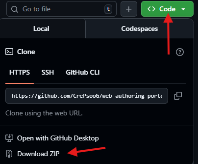

# [Eduard's Website](https://crepsoog.github.io/web-authoring-portofolio-Eduard-Duica/index.html)

## Overview
The project contains a description of me and what my hobbies and future plans are.

The purpose of this website portofolio is to demonstrate my practical web development skills and understanding of HTML and CSS.

## What I learned
This project was challenging. I learned to plan and design the website before building it.

While doing the project, I not only learned about CSS Flexbox and how to use it but also, more about having a good website design.

# Page contents:
## Home:
The home page contains:
- a paragraph about who I am
- the other 2 topics that are: 
    - My Hobbies 
    - Future plans
- a form if you would like to leave feedback

## My Hobbies:
My hobbies page contains details about my hobbies and some examples of what those are. It also contains a table with data and 2 photos

## Future plans:
Future plans page is about what I want to achieve and what my plans are for the future put into 2 lists.

## Special Features:
- Interactive elements such as:
    - links
    - images
    - buttons

- Responsive design

# How access and interact with the website: 
If you are interested in interacting with the website there are a few ways: 

1. (Online) Click this [link](https://crepsoog.github.io/web-authoring-portofolio-Eduard-Duica/index.html)
2. (Offline) **Download** the files from GitHub:
    - Visit this [link](https://github.com/CrePsooG/web-authoring-portofolio-Eduard-Duica) 
    - Click the **green button** and select **Dowload ZIP** 
    - **Unzip** the downloaded files (make sure the files are in the same folder)
    - Navigate to the folder and open the file named **index.html** (the file may have the name **index** without the **.html** part, depending on operating system settings)

## Technologies used:
- HTML5
- CSS3
- Flexbox (CSS flexible box layout)

# Credits and Attributions:

- Photo by Constantine Kim: https://www.pexels.com/photo/cityscape-at-night-10635648/

- Photo by Pixabay: https://www.pexels.com/photo/black-mountains-under-the-stars-at-nighttime-355465/

- Photo by Pixabay: https://www.pexels.com/photo/grey-concrete-buildings-under-cloudy-sky-417192/

- Red Dead Redemption 2. Rockstar Games, 2018. Windows PC game.

- Nier: Automata. Directed by Yoko Taro, PlatinumGames / Square Enix, 2017. Windows PC game.

- Portal 2. Directed by Joshua Weier, Valve, 2011. Windows PC game.

- Wikipedia Contributors (2018). HTML. [online] Wikipedia. Available at: https://en.wikipedia.org/wiki/HTML.

- Wikipedia Contributors (2020). CSS. [online] Wikipedia. Available at: https://en.wikipedia.org/wiki/CSS.

