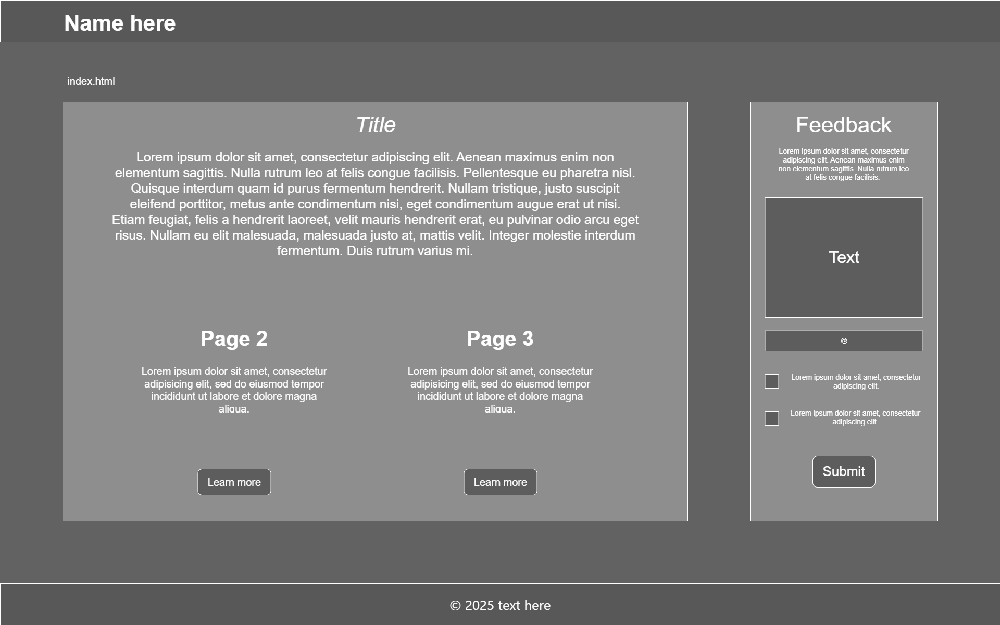
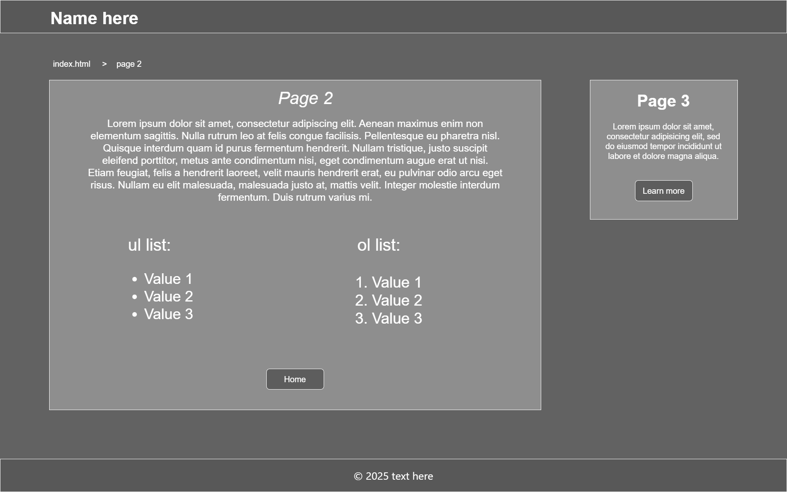
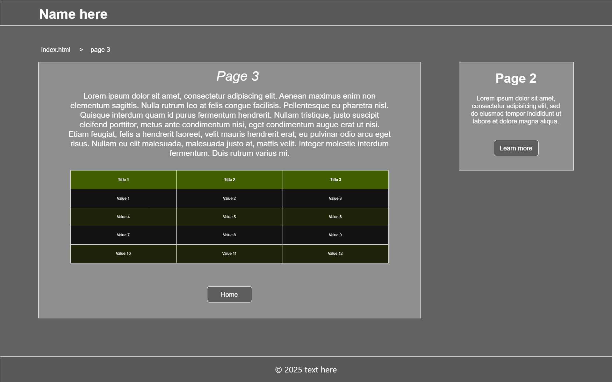

# Description:
The purpose of portofolio: 

Target audience: everyone

## Planning main page

- **Header** with the name of the my website
- a nav showing the page you are on
- 2 boxes: left and right
- the box on the right (about the project):
    - A h2 size **title** in the top middle of the box
    - A **paragraph** with text
    - below the paragraph 2 short (about page 2 and 3) descriptions next to each other:
        - each description has a title
        - describle what the following is about
        - button below each of them -> link to correct page 
- the box on the left (form):
    - A h2 size **title** in the top middle of the box
    - A **paragraph** with text
    - a text input field
    - a email input field
    - 2 check boxes with text on the left
    - **submit button**
- **Background**: a picture
- **Footer** with text and a **symbol**

## Planning Page 2: 
- **Header** with the name of the my website
- a nav showing the page you are on
- 2 boxes: left and right
- the box on the right:
    - A h2 size **title** in the top middle of the box
    - A **paragraph** with text
    - below the paragraph 2 lists (ol and ul) with list items:
        - lists are next to each other
    - home **button** -> link to home
- the box on the left (go to page 3):
    - A h2 size **title** in the top middle of the box
    - A **paragraph** with text (about page)
    - Learn more **button** -> link to page 3
- **Background**: a picture
- **Footer** with text and a **symbol**

## Planning Page 3: 
- **Header** with the name of the my website
- a nav showing the page you are on
- 2 boxes: left and right
- the box on the right:
    - A h2 size **title** in the top middle of the box
    - A **paragraph** with text
    - below the paragraph a **data table**
    - home **button** -> link to home
- the box on the left (go to page 2):
    - A h2 size **title** in the top middle of the box
    - A **paragraph** with text (about page)
    - Learn more **button** -> link to page 2
- **Background**: a picture
- **Footer** with text and a **symbol**

## General design:

- header containing the name of the website located on the top left of the page
- a nav with links to different pages 
- 2 boxes, slightly transparent:
    - one main box with the main topic of the page
    - second smaller box on the right next to the main box
- a footer with the a symbol and some text
- and a background picture

## Navigation:
I chose a navigation system with buttons because it's easy to use and understand. In order to go the main page you can: 
- click the name of the website (top left)
- use home button that is present on every page (near bottom page)
- use the nav system above main left box

# Layout Sketches

Sketches done with [draw.io](https://app.diagrams.net/)

### Technologies to be used:
- HTML
- CSS
- Flexbox (CSS flexible box layout)
- [Pexels](https://www.pexels.com/) for images
- [Visual Studio Code](https://code.visualstudio.com/download)
- [GitHub](https://github.com/)
 
 HTML has advanced over the years

## HTML tags to be used effectively: 
- **&lt;h1&gt;** to **&lt;h6&gt;** tags for titles
- **&lt;p&gt;** tags for paragraphs
- **&lt;a&gt;** tags for links and buttons
- **&lt;ul&gt;** and **&lt;ol&gt;** for unordered lists and ordered lists
- **&lt;li&gt;** tags for list items

## CSS properties to be implemented:
- **color** property for text color
- **background-color** property for the background color of the boxes and buttons
- **text-align** property for aligning text in the center
- **padding** property for padding inside of the boxes
- **box-sizing** property to allow me to include padding without making the boxes bigger