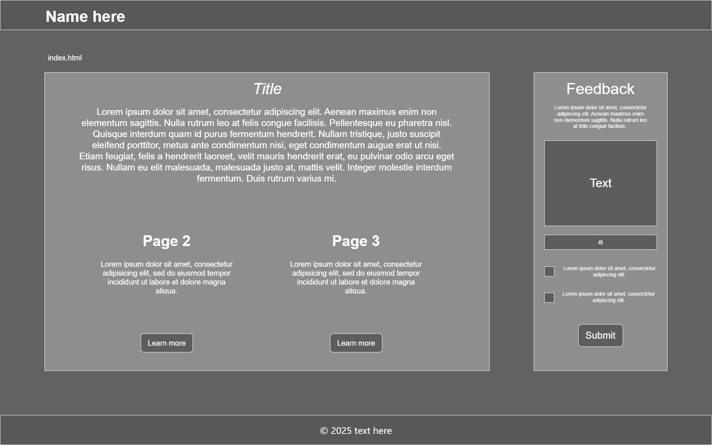
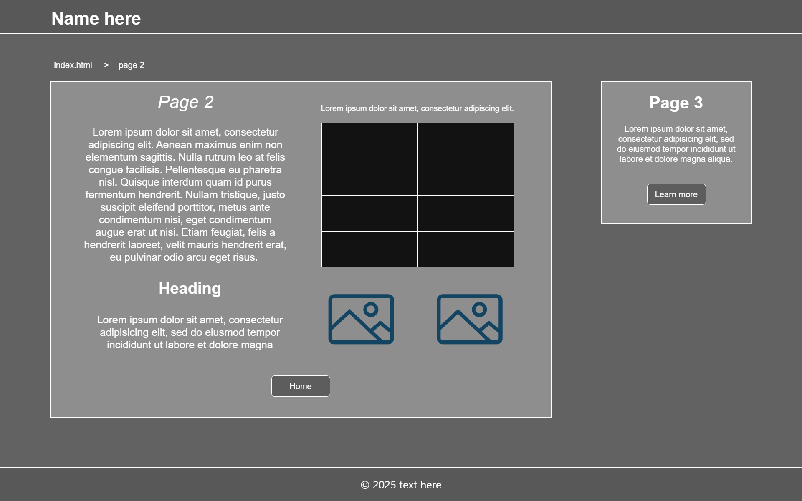
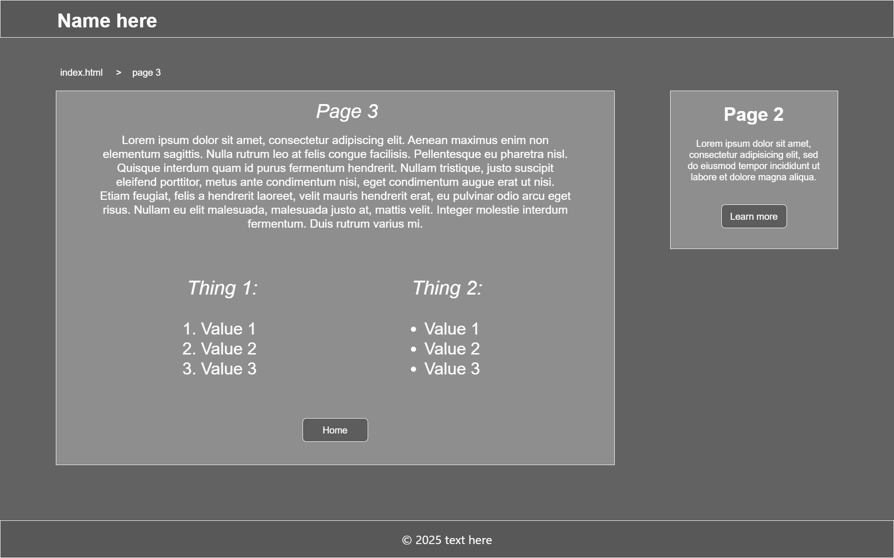

# Description:
The purpose of this portofolio is to demonstrate my practical web development skills and understanding of HTML and CSS. 

Target audience: everyone

## Planning main page

- **Header** with the name of the my website
- a **nav** showing the page you are on in **bold text** and other avalible pages
- 2 boxes: left and right
- the box on the left (about the project):
    - a big box
    - A h2 size **title** in the top middle of the box
    - A **paragraph** with text
    - below the paragraph 2 short (about page 2 and 3) descriptions next to each other:
        - each description has a title
        - describe what the topic is about
        - button below each of them -> link to correct page 

- the box on the right (form):
    - a smaller box
    - A h2 size **title** in the top middle of the box
    - A **paragraph** with text
    - a text input field
    - an email input field
    - 2 check boxes with text on the right
    - **submit button**
- **Background**: a picture
- **Footer** with text and a **symbol**

## Planning Page 2: 
- **Header** with the name of the my website
- a nav showing the page you are on in **bold text** and other avalible pages
- 2 boxes: left and right
- the box on the left:
    - a big box
    - A h2 size **title** near the top left of the box
    - A **paragraph** with text below the title
    - to the left of the paragraph a **data table**
    - below the main paragraph a title and a paragraph
    - next to the title and paragraph 2 pictures
    - home **link** (in the middle of the box) -> link to home

- the box on the right (go to page 3):
    - a smaller box
    - A h2 size **title** in the top middle of the box
    - A **paragraph** with text (about page)
    - Learn more **link** -> link to page 3
- **Background**: a picture
- **Footer** with text and a **symbol**

## Planning Page 3: 
- **Header** with the name of the my website
- a nav showing the page you are on
- 2 boxes: left and right
- the box on the right:
    - A h2 size **title** in the top middle of the box
    - A **paragraph** with text
    - below the paragraph 2 lists (ol and ul) with list items:
        - lists are next to each other
    - home **link** -> link to home

- the box on the left (go to page 2):
    - A h2 size **title** in the top middle of the box
    - A **paragraph** with text (about page)
    - Learn more **button** -> link to page 2
- **Background**: a picture
- **Footer** with text and a **symbol**

## General design:

- header containing the name of the website located at the top left of the page
- a nav with links to different pages
- 2 boxes, slightly transparent:
    - one main box with the main topic of the page
    - second smaller box on the right next to the main box
- a footer with the a symbol and some text
- the color of the text is white on a slightly transparent background
- a background picture

## Navigation:
I chose a navigation system with buttons and links because it's easy to use and understand. 

While you are on the main page, in order to view other pages you can:
- click the **links** on the nav system above the main big box
- click the buttons on the **Home** page that are located at near the bottom of the main big box

When you are on ther pages you can:
- click the **Learn more** link that is located in the small box found on the right of the page to go to other pages
- click the links on the nav system above the main big box to go **Home** or other pages
- use the **Home** button or link that is present on every page (near the bottom of the page in the middle, exept the Home page)

# Layout Sketches

Sketches done with [draw.io](https://app.diagrams.net/)

### Technologies to be used:
- HTML
- CSS
- Flexbox (CSS flexible box layout)
 
 ## Evolution of HTML and CSS
 When HTML (HyperText Markup Language) was first released in 1993, it only had support for displaying text and links. 
 - In 1995, HTML 2 introduced support for images, forms and tables. 
 - In Jan. 1997, HTML 3 introduced support for CSS 1 (Cascading Style Sheets) and JavaScript. 
 - In Dec. 1997, HTML 4 incouraged the use of CSS and introduced new semantic elements
 - In 2014, HTML 5 introduced support for audio, video, SVGs and responsive web design with media queries, etc.. This is the version that is still updated and used in 2025

 CSS (Cascading Style Sheets) is used to style HTML. 
 - In 1996, CSS 1 introduced support for font properties, color of elements, text attributes, alignment of elements, margins, borders and padding.
 - In 1998, CSS 2 added new capabilities such as absolute, relative, and fixed positioning of elements
 - Work on CSS 3 started around 1999 and is still evolving in 2025. CSS 3 was divided into serveral separate modules. Each module adding new capabilities such as Flexbox, CSS Grid, media queries, gradients, etc., or extending features from CSS 2 to preserve backward compatibility. 

## HTML tags to be used effectively: 
- **&lt;h1&gt;** to **&lt;h6&gt;** tags for titles
- **&lt;p&gt;** tags for paragraphs
- **&lt;a&gt;** tags for links and buttons
- **&lt;ul&gt;** and **&lt;ol&gt;** for unordered lists and ordered lists
- **&lt;li&gt;** tags for list items

## CSS properties to be implemented:
- **color** property for text color
- **background-color** property for the background color of the boxes and buttons
- **text-align** property for aligning text in the center
- **padding** property for padding inside of the boxes
- **box-sizing** property to allow me to include padding without making the boxes bigger

## Timeline: 
- 5 - 7 November 2025
    - Work on planning.md the general layout and README.md

- 7 - 9 November 2025
    - Make the pages and add contents to all pages

- 11 - 12 November 2025
    - Fix issues with the layout and make changes to the layout

- 18 - 19 November 2025
    - Finish planning.md and README.md
    - Finish and fix website layout

- 20 - 23 November 2025
    - Replace placeholder text
    - Finish Project 
